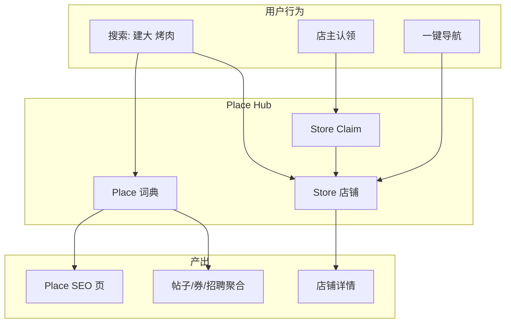
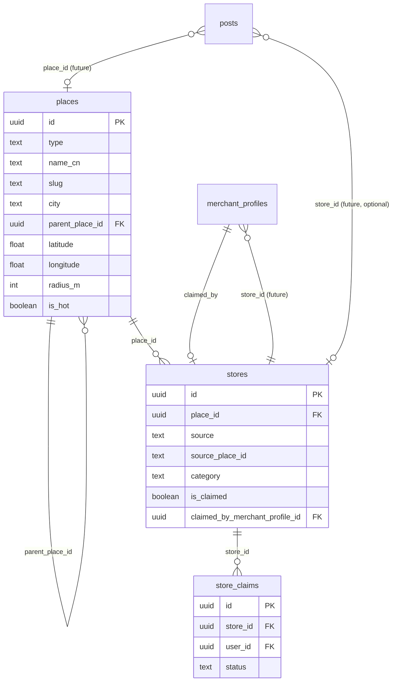
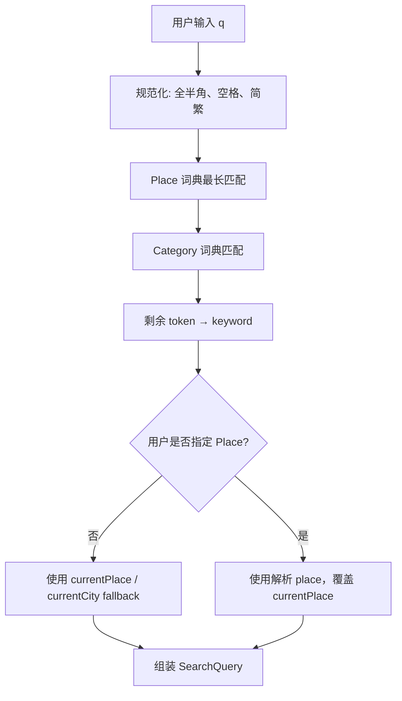
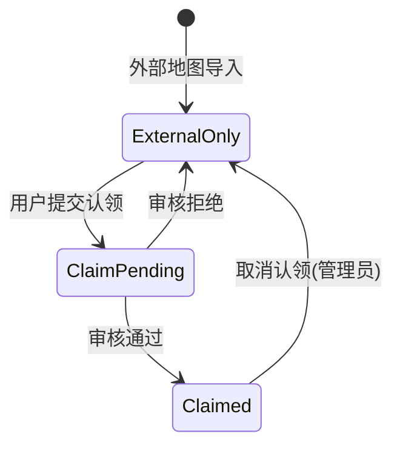
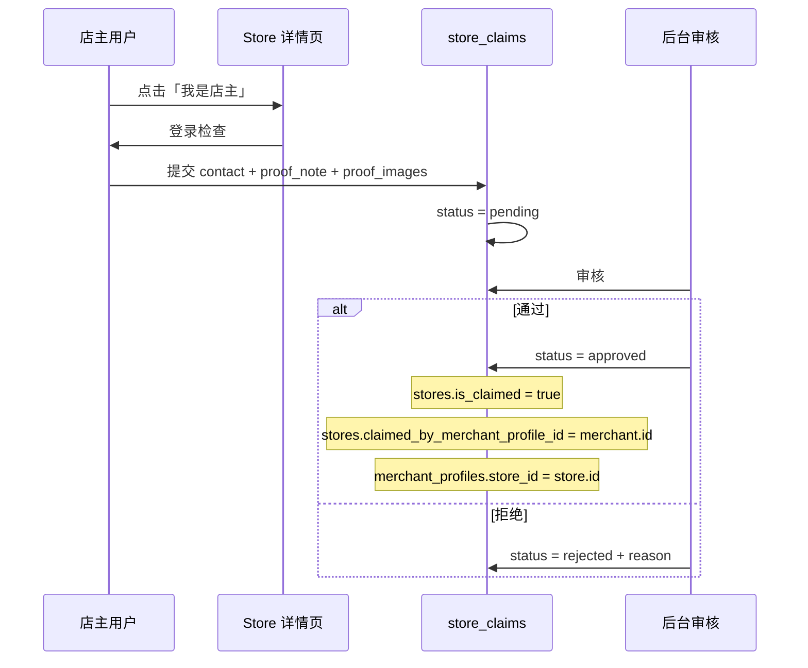
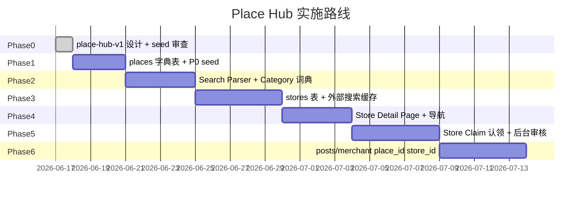

# Place Hub V1 — 韩圈地点与店铺统一体系设计

> **版本**：v0.3 Phase 0（设计）  
> **状态**：Draft — 不含业务代码、不含 migration 执行  
> **基线**：韩圈 v0.2.2 + [region-hub-v1.md](./region-hub-v1.md) / [region-seed-v1.md](./region-seed-v1.md)  
> **主模型定位**：Place Hub 为 v0.3+ **主模型**；Region Hub 保留为宏观 fallback 与历史参考  
> **最后更新**：2026-06-17

---

## 1. 为什么从 Region Hub 升级到 Place Hub

### 1.1 产品判断

Region / Area 模型解决的是**「帖子在哪个行政区」**，但用户在韩圈的真实行为是：

| 用户输入 | 真实意图 |
|----------|----------|
| 建大 理发 | 在**建大**附近找**理发**店/帖 |
| 江南 牙科 | 在**江南**找**牙科** |
| 弘大 烤肉 | 在**弘大**找**烤肉**探店 |
| 安山 兼职 | 在**安山**找**招聘/兼职** |
| 西面 酒吧 | 在**釜山西面**找**酒吧** |

这是 **地点（Place）+ 服务/品类（Category）+ 关键词（Keyword）** 的搜索，而不是「首尔市 / 京畿道」的行政筛选。

### 1.2 Region/Area 的局限

| 维度 | Region Hub | 用户习惯 |
|------|------------|----------|
| 粒度 | 都市圈 + 粗略商圈 | 建大、江南站、COEX、弘大入口 |
| 语义 | 行政/地理分区 | 生活地标、大学、地铁站、商场 |
| 搜索 | Facet 筛 Region | 「地点 + 服务」自然语言 |
| 商家 | 商家挂地区 | 海底捞建大店、Olive Young 江南店 |
| 导航 | 无 | 一键跳转 Naver/Kakao Map |
| 认领 | 无 | 「我是店主」认领具体店铺 |

**Region/Area 太行政化**：对发帖「附近 Tab」仍有价值，但无法支撑店铺搜索、店铺详情、认领与导航。

### 1.3 Place Hub 能覆盖什么



| 能力 | Place Hub | Region Hub only |
|------|-----------|-----------------|
| 地点 + 服务搜索 | ✅ | ❌ |
| 店铺详情 / 外部地图数据 | ✅ | ❌ |
| 商家认领 | ✅ Store | ❌ |
| SEO `/places/seoul/konkuk` | ✅ | 仅 `/regions/...` |
| 发帖地区 | ✅ `place_id` | ✅ `area_id` |
| 宏观附近 Tab fallback | ✅ `city` type Place | ✅ Region |

### 1.4 核心决策（必读）

| # | 决策 | 说明 |
|---|------|------|
| D1 | **店铺不是 Place** | 「海底捞建大店」是 `Store`，「建大」是 `Place` |
| D2 | **Store 单独建表** | `stores.place_id → places.id` |
| D3 | **认领对象是 Store** | 不是 Place、不是 Region |
| D4 | **一 Place 多 Store** | 商圈下多家店 |
| D5 | **一 Store 一主 Place** | 可保留 `source` + `source_place_id` 外部地图信息 |
| D6 | **不存用户 GPS** | 与 v0.2.2 一致；仅用客户端映射 `currentPlace` |
| D7 | **不显示假距离** | 无精确能力时只显示 Place 名，如「建大」 |

---

## 2. 与 Region Hub 的关系

### 2.1 文档定位

| 文档 | 状态 | 用途 |
|------|------|------|
| [region-hub-v1.md](./region-hub-v1.md) | **保留** | 历史设计、宏观 Region 概念、`posts.location` 迁移参考 |
| [region-seed-v1.md](./region-seed-v1.md) | **保留** | P0 商圈名单可**迁移映射**为 Place seed（`type=area`） |
| **place-hub-v1.md**（本文） | **主模型** | v0.3 起实施路线以 Place/Store 为准 |

### 2.2 概念映射

| Region Hub | Place Hub |
|------------|-----------|
| `regions`（首尔、釜山…） | `places` where `type = city` |
| `areas`（建大、弘大…） | `places` where `type IN (area, university, …)` |
| `area_id` on posts | `place_id` on posts |
| `region_id` on posts | `places.parent` 链或 `city` 字段 + 祖先 Place |

**不重复建 `regions` 表**：宏观城市用 `places.type = city`；商圈/大学/地铁站等用子 Place + `parent_place_id`。

### 2.3 v0.2.2 自动定位 fallback

```
GPS (客户端) 
  → 匹配 places 词典（radius_m）
  → 命中则 currentPlace = place
  → 未命中则 fallback 到 city Place（等同原 Region）
  → 再未命中则 other / 首尔默认
```

---

## 3. 数据模型草案

### 3.1 表：`places`

用户可搜索、可聚合、可 SEO 的**地点词典**（不是店铺）。

| 列名 | 类型 | 约束 | 说明 |
|------|------|------|------|
| `id` | `uuid` | PK | |
| `type` | `text` | NOT NULL, CHECK | `area` \| `university` \| `subway` \| `mall` \| `landmark` \| `district` \| `city` |
| `name_cn` | `text` | NOT NULL | 建大 |
| `name_ko` | `text` | NOT NULL | 건대 |
| `name_en` | `text` | NOT NULL | Konkuk |
| `slug` | `text` | NOT NULL | URL 段，如 `konkuk` |
| `city` | `text` | NOT NULL | 所属城市 slug：`seoul` / `busan` / `incheon` / … |
| `district` | `text` | NULL | 韩文/中文行政区参考：광진구 |
| `parent_place_id` | `uuid` | NULL FK → `places(id)` | 层级：江南站 → 江南；COEX → 江南 |
| `latitude` | `double precision` | NOT NULL | 地点中心（字典坐标，非用户 GPS） |
| `longitude` | `double precision` | NOT NULL | |
| `radius_m` | `int` | NOT NULL default 1500 | 自动定位/匹配半径 |
| `search_aliases` | `text[]` | NULL | 建国大学、건대입구… |
| `is_hot` | `boolean` | NOT NULL default false | 搜索/首页快捷 |
| `is_active` | `boolean` | NOT NULL default true | |
| `sort_order` | `int` | NOT NULL default 0 | |
| `created_at` | `timestamptz` | NOT NULL default now() | |
| `updated_at` | `timestamptz` | NOT NULL default now() | |

**约束**：

- `UNIQUE (city, slug)` — URL `/places/{city}/{slug}`
- `type = city` 时 `parent_place_id IS NULL`
- 子 Place 的 `city` 必须与其祖先 city Place 的 slug 一致（应用层或 trigger）

**Place type 说明**：

| type | 示例 | 典型 parent |
|------|------|-------------|
| `city` | 首尔、釜山、安山（京畿城市可视为 city Place） | — |
| `district` | 江南区（少用，优先 area） | city |
| `area` | 建大、弘大、西面 | city |
| `university` | 高丽大、延世大 | city 或 area |
| `subway` | 江南站、建大站 | area |
| `mall` | COEX、乐天世界 | area |
| `landmark` | 明洞步行街、东大门 DDP | area / city |

**示例层级**：

```
city: seoul (首尔)
  └─ area: gangnam (江南)
       ├─ subway: gangnam-station (江南站)
       └─ mall: coex (COEX)
  └─ area: konkuk (建大)
       └─ university: konkuk-univ (建国大学)
```

### 3.2 表：`stores`

具体**店铺 / 服务点**；可来自外部地图或商家认领。

| 列名 | 类型 | 约束 | 说明 |
|------|------|------|------|
| `id` | `uuid` | PK | |
| `place_id` | `uuid` | NOT NULL FK → `places(id)` | 主关联地点 |
| `source` | `text` | NOT NULL, CHECK | `google` \| `naver` \| `kakao` \| `manual` \| `claimed` |
| `source_place_id` | `text` | NULL | 外部地图 POI ID |
| `name_cn` | `text` | NULL | 中文店名（认领后可补） |
| `name_ko` | `text` | NULL | |
| `name_en` | `text` | NULL | |
| `slug` | `text` | NULL | 认领后生成；`/stores/{slug}` |
| `category` | `text` | NOT NULL | 主品类：理发 / 牙科 / 烤肉 / 搬家… |
| `category_keywords` | `text[]` | NULL | 搜索扩展：麻辣烫、火锅… |
| `address` | `text` | NULL | |
| `phone` | `text` | NULL | 公开展示需合规 |
| `latitude` | `double precision` | NULL | 店面坐标 |
| `longitude` | `double precision` | NULL | |
| `external_url` | `text` | NULL | 外部地图详情链接 |
| `is_claimed` | `boolean` | NOT NULL default false | |
| `claimed_by_merchant_profile_id` | `uuid` | NULL FK → `merchant_profiles(id)` | 审核通过后写入 |
| `verified_at` | `timestamptz` | NULL | 认领审核通过时间 |
| `last_synced_at` | `timestamptz` | NULL | 外部数据同步时间 |
| `is_active` | `boolean` | NOT NULL default true | |
| `created_at` | `timestamptz` | NOT NULL default now() | |
| `updated_at` | `timestamptz` | NOT NULL default now() | |

**规则**：

- **禁止**把 Store 当作 Place 入库。
- `source = claimed` 表示韩圈商家主档；仍可保留原 `naver`/`kakao` `source_place_id` 用于导航深链。
- 同一物理店面：`UNIQUE (source, source_place_id)` WHERE `source_place_id IS NOT NULL`。
- 未认领店**不显示**韩圈认证标识。

### 3.3 表：`store_claims`

商家认领申请与审核记录。

| 列名 | 类型 | 约束 | 说明 |
|------|------|------|------|
| `id` | `uuid` | PK | |
| `store_id` | `uuid` | NOT NULL FK → `stores(id)` | |
| `user_id` | `uuid` | NOT NULL FK → `profiles(id)` | 申请人 |
| `status` | `text` | NOT NULL, CHECK | `pending` \| `approved` \| `rejected` |
| `contact` | `text` | NOT NULL | 手机/微信/Kakao |
| `proof_note` | `text` | NULL | 文字说明 |
| `proof_images` | `text[]` | NULL | Storage 路径 |
| `reviewed_by` | `uuid` | NULL FK → `profiles(id)` | 管理员 |
| `reviewed_at` | `timestamptz` | NULL | |
| `reject_reason` | `text` | NULL | |
| `created_at` | `timestamptz` | NOT NULL default now() | |
| `updated_at` | `timestamptz` | NOT NULL default now() | |

**约束**：同一 `store_id` + `user_id` 同时仅一条 `pending`（部分唯一索引）。

### 3.4 ER 图



### 3.5 品类词典（`categories`，规划表）

搜索解析依赖独立 **Category 词典**（可与 Place 词典并列，Phase 2 实现）：

| 字段 | 说明 |
|------|------|
| `slug` | `hair-salon`, `dental`, `bbq`, `moving`, `part-time` |
| `name_cn` | 理发、牙科、烤肉、搬家、兼职 |
| `keywords` | 理发店、美发、口腔、烧烤、맛집… |
| `maps_to_post_category` | 可选映射：探店 / 招聘 / 房屋 |

---

## 4. 搜索解析设计（Search Parser）

### 4.1 目标

将自然语言查询拆为三个 intent：

```
输入: "江南 理发店"
→ place: gangnam (江南)
→ category: hair-salon (理发)
→ keyword: (空)

输入: "建大 麻辣烫 深夜"
→ place: konkuk
→ category: (火锅/中餐，或 null 由 keyword 承担)
→ keyword: 麻辣烫 深夜
```

### 4.2 解析流水线



### 4.3 规则（优先级）

| 步骤 | 规则 |
|------|------|
| 1 Place | 对 `places.name_cn/ko/en` + `search_aliases` **最长子串优先**匹配；命中 subway/mall 可向上解析 parent area |
| 2 Category | 对 `categories.keywords` 匹配；支持中韩混合：「理发店」「치과」「烤肉」 |
| 3 Keyword | 去除已匹配片段后的剩余文本 |
| 4 位置 fallback | 无 Place → `currentPlace`（客户端自动定位或用户上次选择）→ 再 fallback `currentCity` |
| 5 覆盖 | **用户输入 Place 时，覆盖** currentPlace（不静默混用） |

### 4.4 解析示例

| 输入 | place | category | keyword | 备注 |
|------|-------|----------|---------|------|
| 江南 理发店 | 江南 | 理发 | — | 典型 |
| 建大 麻辣烫 | 建大 | — | 麻辣烫 | 无品类词表命中 |
| 弘大 烤肉 | 弘大 | 烤肉 | — | |
| 安山 兼职 | 安山 (city) | 招聘/兼职 | — | city 也是 Place |
| 西面 酒吧 | 西面 | 酒吧 | — | |
| 理发店 | — | 理发 | — | 用 currentPlace |
| 海底捞 | — | — | 海底捞 | 店名搜索 → Store 索引 |

### 4.5 SearchQuery 结构（API 草案）

```ts
interface ParsedSearchQuery {
  raw: string;
  place: { id: string; slug: string; nameCn: string; city: string } | null;
  category: { slug: string; nameCn: string } | null;
  keyword: string | null;
  locationSource: "query" | "current_place" | "current_city" | "default";
}
```

### 4.6 与现有 `/search` 关系

| 阶段 | 行为 |
|------|------|
| 现 v0.2.2 | `q` → ILIKE posts/users/merchants |
| Phase 2 | 增加 Parser；Tab 可展示 Stores + Posts 分栏 |
| Phase 3+ | Place Facet chips：「建大 ×」「理发 ×」可删除重搜 |

---

## 5. 搜索结果排序

### 5.1 原则

- **不显示假距离**（无可靠距离时不展示 m/km）。
- 可展示 **Place 标签**：「建大」「江南」— 表示内容关联地点，非直线距离。
- 排序可使用内部距离分数，但**不对用户展示**。

### 5.2 优先级（降序）

| 优先级 | 信号 | 适用对象 |
|--------|------|----------|
| 1 | **已认证 Store**（`is_claimed = true`） | stores |
| 2 | **同 Place 匹配**（`place_id` 或帖子 `place_id`） | stores, posts |
| 3 | **有优惠券 / 商家帖子** | stores, posts |
| 4 | **外部地图基础数据**（naver/kakao/google, 未认领） | stores |
| 5 | **普通用户帖子** | posts |
| 6 | **热度 / 更新时间** | 全部 |

同优先级内：

- Store：认领 > 有电话/地址完整 > `last_synced_at` 新
- Post：`created_at` 新 > 点赞多（现有逻辑）

### 5.3 结果混排 UI（草案）

```
搜索：建大 烤肉

[地点] 建大 ›

── 店铺 ──
🟢 韩圈认证 · OO烤肉（认领）        [建大]
   Naver Map · 优惠券

── 地图结果 ──
○ XX炭火烤肉（Naver）              [建大]
   一键导航

── 社区帖子 ──
○ 建大附近好吃烤肉推荐              [建大]
   …
```

未显示「350m」「1.2km」等文案。

---

## 6. 店铺详情页设计

路由：`/stores/{slug-or-id}`

### 6.1 未认领 Store

| 区块 | 内容 |
|------|------|
| 头部 | 店名（韩/中）、品类 |
| 地址 | 文本地址 |
| 电话 | 若有则展示；点击拨号 |
| 来源 | 标注「数据来源：Naver Map」等，**不伪造** |
| 导航 | 一键导航（§8） |
| CTA | **「我是店主，认领这个店铺」** → 认领表单 |
| 认证 | **无**韩圈认证标识 |
| 帖子 | **不展示**商家帖子/优惠券 |
| 免责声明 | 营业时间/价格以店内为准；韩圈未验证 |

### 6.2 已认领 Store

| 区块 | 内容 |
|------|------|
| 头部 | 店名 + **韩圈认证** 标识 |
| 商家 | 链接 `merchant_profiles` 主页 |
| 内容 | 商家帖子列表（探店/优惠） |
| 优惠券 | `merchant_coupons` 有效券 |
| 介绍 | 中文商家简介（商家编辑） |
| 图片 | 商家 Logo / 店铺图 |
| 导航 | 一键导航 |
| 地址/电话 | 商家维护版（可覆盖外部数据） |

### 6.3 状态机



---

## 7. 商家认领流程

### 7.1 用户侧



### 7.2 审核通过后写入

| 实体 | 变更 |
|------|------|
| `stores` | `is_claimed = true`, `claimed_by_merchant_profile_id`, `verified_at`, `source` 可置 `claimed` |
| `merchant_profiles` | 新增 `store_id`（Phase 6）绑定 |
| `store_claims` | `status = approved`, `reviewed_by`, `reviewed_at` |

### 7.3 商家能力解锁

- 以该 Store 为主体发**商家帖**、绑**优惠券**
- 编辑中文介绍、店铺图片（复用现有 merchant profile 能力）
- **不得**自动获得其他 Store 的认证

### 7.4 冲突处理

| 场景 | 处理 |
|------|------|
| 一店多认领 | 仅一条 `approved`；后续 `pending` 自动拒绝 |
| 无 merchant_profile | 认领前引导创建/升级为商家账号 |
| 外部店名与认领名不一致 | 审核时人工确认；允许 `name_cn` 覆盖展示 |

---

## 8. 一键导航

### 8.1 第一版范围

- **不做**路线规划、不做站内地图。
- **只做**跳转外部地图 App / Web。

### 8.2 优先级（韩国本地）

1. **Naver Map**
2. **Kakao Map**
3. **Google Maps**（fallback / 国际用户）

### 8.3 深链草案

| 平台 | 参数 | 示例 |
|------|------|------|
| Naver | `lat`, `lng`, `title` | `nmap://place?lat=...&lng=...&name=...` |
| Kakao | `lat`, `lng` | `kakaomap://look?p=lat,lng` |
| Google | `lat`, `lng` | `https://www.google.com/maps/search/?api=1&query=lat,lng` |

优先使用 `stores.source_place_id` 构造平台原生链接；无 ID 时用 `latitude/longitude` + 店名。

### 8.4 UI

```
[ Naver Map ]  [ Kakao Map ]  [ Google Maps ]
```

底部免责声明：导航由第三方提供，韩圈不负责路线准确性。

---

## 9. SEO 设计

### 9.1 URL 结构

| 类型 | 路径 | 示例 |
|------|------|------|
| Place 页 | `/places/{city}/{slug}` | `/places/seoul/konkuk` |
| Place 页（city） | `/places/{city}` | `/places/seoul` |
| Store 页 | `/stores/{slug-or-id}` | `/stores/haidilao-konkuk` |

> 与 Region Hub 的 `/regions/...` **并存过渡期**；canonical 以 Place 为准，旧 URL 301 规划在 Phase 4。

### 9.2 Place 页聚合内容

| 模块 | 数据源 |
|------|--------|
| 店铺列表 | `stores WHERE place_id IN (place + descendants)` |
| 社区帖子 | `posts WHERE place_id …`（Phase 6） |
| 优惠券 | 认领 Store 的有效券 |
| 攻略 | `category = 攻略` 帖子 |
| 招聘/租房 | `category IN (招聘, 房屋)` 帖子 |

**H1 模板**：`{name_cn} — 华人租房、招聘、探店、店铺`

### 9.3 Store 页 SEO

- 未认领：`noindex` 或弱索引（避免薄内容站群）
- 已认领：`index, follow`；title = `{店名} - {place.name_cn} - 韩圈`

### 9.4 结构化数据

Place 页 JSON-LD `@type: Place`；认领 Store 页 `@type: LocalBusiness` + `parentPlace`。

---

## 10. 与现有系统关系

### 10.1 当前 v0.2.2 资产

| 现有 | Place Hub 演进 |
|------|----------------|
| `posts.location` text | **过渡保留**；双写 `place_id` + 显示串 |
| `posts.distance` | 废弃；UI 不展示 |
| `merchant_profiles.address` | 保留；加 `store_id` 绑定认领店 |
| `merchant_profiles` 商家帖/券 | 认领后挂 `store_id` |
| `lib/feed/geo-region.ts` | fallback → `places` 词典匹配 |
| `hanquan:selected-region` | 演进为 `hanquan:selected-place-id` 或兼容映射 |
| 搜索 `search-posts.ts` | 增加 Parser + Store 索引 |

### 10.2 未来字段（Phase 6，本阶段不 migration）

**`posts` 新增**：

| 列 | 说明 |
|----|------|
| `place_id` | uuid FK → places |
| `store_id` | uuid NULL FK → stores（探店帖可选） |
| `location` | 保留 denormalized：`首尔 · 建大` |

**`merchant_profiles` 新增**：

| 列 | 说明 |
|----|------|
| `store_id` | uuid NULL FK → stores（认领后主绑定） |

### 10.3 与社区帖、优惠券

- 普通用户发帖：选 **Place**（必选），不选 Store。
- 商家发帖：默认 `store_id` = 认领店；`place_id` 继承自 Store。
- 优惠券：仍绑帖子；帖子有 `store_id` 时详情页聚合展示。

---

## 11. 分阶段实施路线



| Phase | 交付 | 不改业务？ |
|-------|------|------------|
| **0** | 本文档 + `place-seed-v1.md`（待写，可由 region-seed 迁移） | ✅ |
| **1** | `places` 表 + P0 seed（~26 area + city）；RLS 只读 | ✅ 不改发帖/搜索 UI |
| **2** | `lib/search/parser` + Category 词典；搜索页解析 chips | 只读 places |
| **3** | `stores` 表；手动/合规 API 缓存；搜索出 Store 结果 | 无认领 |
| **4** | `/stores/[id]` + 导航按钮；Place 页 `/places/...` MVP | |
| **5** | `store_claims` + 后台审核 + 认证标识 | |
| **6** | `posts.place_id`、`merchant_profiles.store_id`、双写迁移 | |

**Region Hub Phase 1 建议暂停**：优先 Place Hub Phase 1，避免 `regions` + `places` 双字典并行。

---

## 12. 风险与边界

| 边界 | 说明 |
|------|------|
| 不违反地图平台 ToS | 不用爬虫批量抓取；用官方 API / 用户搜索触发缓存 / 人工录入 |
| 不伪造店铺信息 | 外部来源必须标注；认领前不冒充商家 |
| 不显示未验证认证 | 仅 `is_claimed && verified_at` 显示韩圈认证 |
| 不承诺营业时间准确 | 未认领店不展示营业时间；认领店由商家自负 |
| 不存用户精确 GPS | 客户端映射 only |
| 不显示虚假距离 | UI 只显示 Place 名，不显示 m/km |
| 一店多源去重 | `source + source_place_id` 唯一；跨源合并人工 |

---

## 13. 附录

### 13.1 Place 示例（非 Store）

| name_cn | type | city | slug |
|---------|------|------|------|
| 建大 | area | seoul | konkuk |
| 弘大 | area | seoul | hongdae |
| 江南 | area | seoul | gangnam |
| 江南站 | subway | seoul | gangnam-station |
| COEX | mall | seoul | coex |
| 明洞 | area | seoul | myeongdong |
| 东大门 | area | seoul | dongdaemun |
| 安山 | city | ansan | ansan |
| 富平 | area | incheon | bupyeong |
| 西面 | area | busan | seomyeon |

### 13.2 Store 示例（非 Place）

| name | place | source |
|------|-------|--------|
| 海底捞建大店 | 建大 | naver |
| Olive Young 江南店 | 江南 | kakao |
| OO 理发店 | 建大 | manual |
| OO 牙科 | 江南 | google |

### 13.3 文档索引

| 文档 | 关系 |
|------|------|
| [region-hub-v1.md](./region-hub-v1.md) | 前身；宏观 fallback |
| [region-seed-v1.md](./region-seed-v1.md) | P0 名单 → 迁移为 `places` seed |
| [place-hub-v1.md](./place-hub-v1.md) | **主模型（本文）** |

### 13.4 验收标准（实现阶段）

- [ ] `places` P0 seed ≥ 26 + city Place
- [ ] Parser 对 5 个示例查询解析正确（§4.4）
- [ ] 搜索结果不展示假距离
- [ ] 未认领 Store 无认证标识、无商家帖
- [ ] 认领审核通过后才 `is_claimed`
- [ ] 导航跳转 Naver/Kakao/Google 可用
- [ ] 用户 GPS 不入库
- [ ] build + regression PASS

---

*本文档为 v0.3 Place Hub Phase 0 交付物。下一步建议：先 `places` seed 审查，再 Search Parser。*
