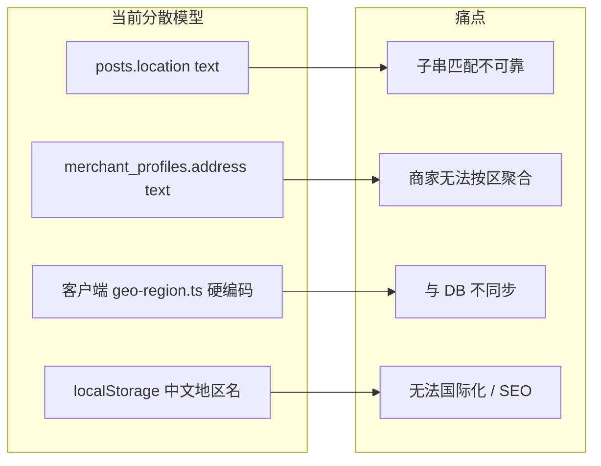
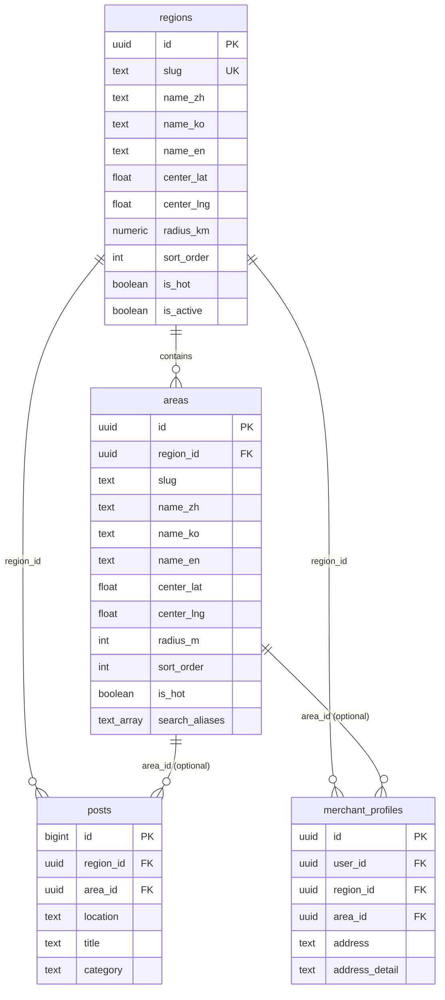
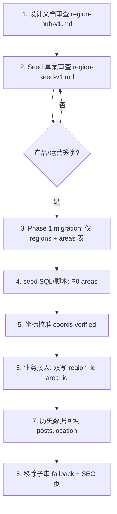
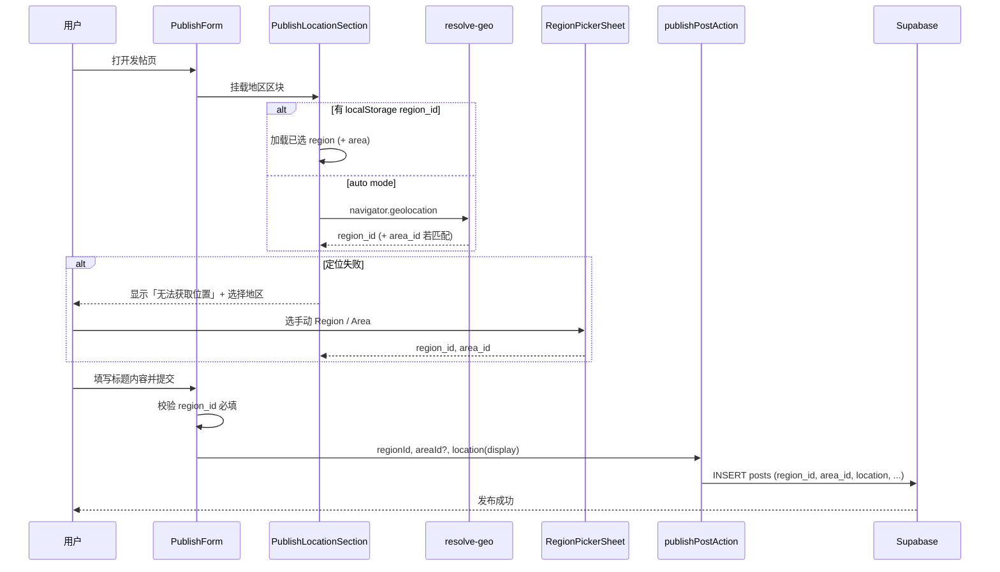
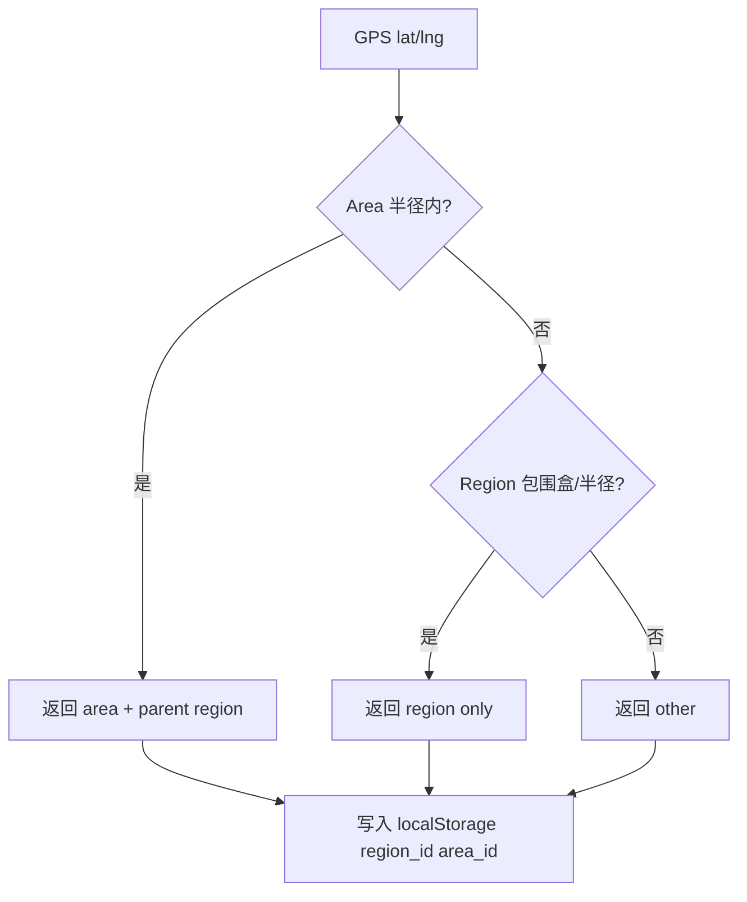
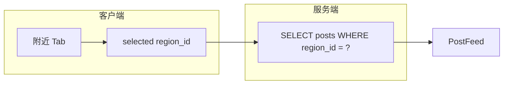
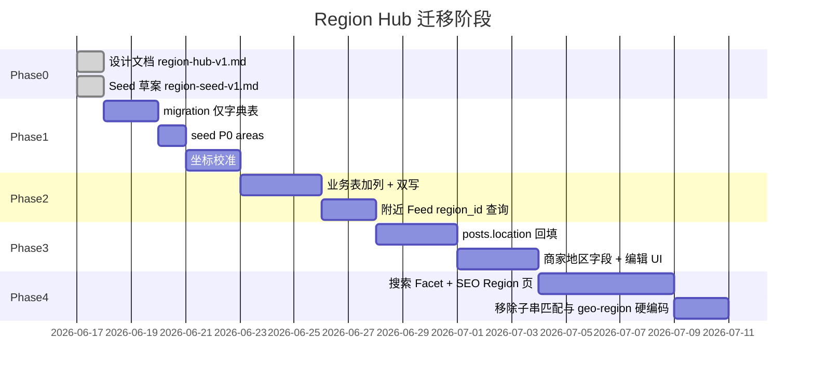

# Region Hub V1 — 韩圈统一地区体系设计

> **版本**：v0.3 Phase 0（设计 + Seed 草案审查）  
> **状态**：Draft — 不含业务代码、不含 migration 执行  
> **主模型**：**已由 [place-hub-v1.md](./place-hub-v1.md) 接替**；本文档保留作宏观 Region/Area 参考与 `posts.location` 迁移附录  
> **基线**：韩圈 v0.2.2（Nearby Auto Region + Publish Location UX）  
> **关联文档**：[region-seed-v1.md](./region-seed-v1.md)（商圈种子草案，可迁移为 Place seed）、[place-hub-v1.md](./place-hub-v1.md)  
> **最后更新**：2026-06-17

---

## 1. 背景与目标

### 1.1 为什么要做 Region Hub

当前韩圈的「地区」是**分散、非结构化**的：

| 场景 | 现状 | 问题 |
|------|------|------|
| 发帖 | `posts.location` 为 `text`，v0.2.2 起仅写入 9 个宏观地区中文名 | 无法表达「建大 / 弘大」等细粒度；历史数据仍是自由文案 |
| 附近 Feed | 客户端 `location.includes(region)` 子串匹配 | 误匹配、漏匹配；无法按商圈聚合 |
| 商家 | `merchant_profiles.address` 自由文本 | 无法按地区筛选商家、做 SEO 落地页 |
| 搜索 | 帖子搜 `title/content/author`；商家搜 `business_name/description/address` | 无地区 Facet；地址搜索靠 ILIKE，质量差 |
| 自动定位 | 客户端 bounding box → 9 个宏观地区 | 逻辑硬编码在 `geo-region.ts`，与 DB 脱节 |
| SEO | 无地区 URL | 无法做「首尔租房」「建大探店」等长尾页 |

**Region Hub V1** 的目标：建立 **Region（宏观地区）+ Area（商圈/片区）** 两级统一数据模型，作为帖子、商家、招聘、租房、活动、SEO、搜索的**唯一地区真相源（Single Source of Truth）**。

### 1.2 设计原则（继承 v0.2.2）

1. **用户 GPS 坐标不入库** — 定位仅在客户端用于映射 `region_id` / `area_id`；Supabase 不存用户经纬度。
2. **不展示 m/km 假距离** — 附近排序可用「同 Area 优先」等业务规则，不恢复 `posts.distance` UI。
3. **渐进迁移** — 保留 `posts.location` 显示字段过渡期；新字段并行写入，旧逻辑可回退。
4. **RLS 只读公开** — `regions` / `areas` 为公共字典表，anon 可读；仅 service_role / admin 可写。
5. **多语言友好** — 中/韩/英三语名称 + 稳定 `slug` 供 URL 与 API。

### 1.3 非目标（本阶段）

- 不实现结构化租房/招聘表单（仅预留 `area_id` 外键位）。
- 不做地图选点、不做门店 POI 全量库。
- 不改造评论、频道、广场 Banner 的地区逻辑（后续按需挂接）。

### 1.4 设计约束速查（Phase 0 审查项）

以下约束为 Region Hub 的**硬性原则**，实现阶段不得偏离：

| # | 约束 | 说明 | 文档锚点 |
|---|------|------|----------|
| C1 | **regions / areas 字段明确** | 字典表字段见 §4.1–§4.2；种子审查字段见 [region-seed-v1.md](./region-seed-v1.md) | §3.2、§4 |
| C2 | **不存用户 GPS** | `navigator.geolocation` 仅在客户端内存中用于映射 `region_id` / `area_id`；**禁止**写入 `posts`、`profiles`、日志表或 analytics | §1.2、§8、§14 |
| C3 | **不显示 m/km 距离** | UI 不展示 `posts.distance`；附近排序用 Area 优先 / 时间序，**不**恢复假距离文案 | §1.2、§11.2、§14 |
| C4 | **`posts.location` 过渡保留** | 迁移期继续双写：`region_id` + `area_id` + denormalized `location` 显示串；**v0.4+** 才考虑只读/废弃 | §4.3、§7.3、§13.3 |
| C5 | **text → area_id 迁移路径** | 五阶段：双写 → region_id 查询 → 回填脚本 → 切换 UI → 移除子串 fallback；详见 §13.4 | §13 |

**字段命名约定**：

- 数据库列：`name_zh` / `name_ko` / `name_en`（与现 `database.types.ts` 风格一致）。
- Seed 审查文档：使用 `name_cn` 便于产品/运营阅读；入库时映射为 `name_zh`。

**字典表 vs 业务表（Phase 1 边界）**：

- Phase 1 migration **仅**创建 `regions` + `areas` 及 seed，**不** `ALTER posts` / `merchant_profiles`。
- 业务表加列与双写在 Phase 2 单独 migration 执行。

---

## 2. 现状调研（v0.2.2 基线）

### 2.1 `posts.location`

**数据库**（`public.posts`）：

```sql
location text NOT NULL   -- 自由文本，必填
distance text NOT NULL   -- 历史假距离字段，UI 已隐藏，写入默认值 "350m"
nearby boolean           -- 历史标记，Feed 不再依赖
```

**写入路径**：

- 用户发帖：`PublishLocationSection` → `resolvePublishLocation(region)` → 宏观地区中文名（如 `首尔`）。
- `publishPostAction` 原样写入 `location`；`distance` 固定 `DEFAULT_POST_DISTANCE = "350m"`。
- 自动发帖脚本（`lib/auto-post/*`）仍可能写入细粒度文案（如 `建大`、`延世大学`）。

**读取与筛选**：

- `postMatchesSelectedRegion`：`post.location.includes(selectedRegion)`。
- `selectedRegion === "其他"`：不匹配 8 个可匹配宏观地区名。

**历史数据特征**（seed / 旧帖）：

- 细粒度中文：`建国大学`、`建大`、`延世大学`、`仁川机场` 等。
- 与 v0.2.2 宏观地区名共存，导致附近 Tab 行为不一致。

### 2.2 `merchant_profiles`

**数据库**：

```sql
address text NULL   -- 商家自由文本地址，无地区外键
```

**使用**：

- 商家资料编辑：`MerchantProfileEditForm` 自由输入「地址」。
- 搜索：`search-merchants.ts` 对 `address` 做 ILIKE + 匹配打分。
- 公开展示：`SearchMerchantResultItem` 直接渲染 `address`。
- Seed 数据示例：`address = '首尔'`（与帖子宏观地区同名但无关联）。

**缺失**：`region_id`、`area_id`、结构化门牌/楼层字段。

### 2.3 搜索

| 类型 | 查询字段 | 地区能力 |
|------|----------|----------|
| 帖子 | `title`, `content`, `author` | 无 |
| 用户 | `username`, `nickname` | 无 |
| 商家 | `business_name`, `description`, `address`, `phone` | 仅地址子串 |

- 路由：`/search?q=...`（`robots: noindex`）。
- 无 `region` / `area` query param，无 Facet UI。

### 2.4 附近 Feed

```
用户打开「附近」Tab
  → 若 locationMode !== manual 且无 persisted region
  → useNearbyLocation (navigator.geolocation)
  → getRegionFromCoordinates(lat, lng)  // 客户端 bounding box
  → saveAutoSelectedRegion(region)
  → filterPosts(..., channel="附近", selectedRegion)
  → postMatchesSelectedRegion (子串)
```

**localStorage**（仅客户端）：

- `hanquan:selected-region` — 宏观地区中文名
- `hanquan:location-mode` — `auto` | `manual`

### 2.5 自动定位

`lib/feed/geo-region.ts` 硬编码 8 个 bounding box + fallback `其他`：

| 地区 | 大致范围 |
|------|----------|
| 首尔 | 37.42–37.70°N, 126.76–127.20°E |
| 仁川 | 37.30–37.65°N, 126.35–126.85°E |
| 京畿 | 36.85–38.30°N, 126.45–127.85°E |
| 釜山 / 大邱 / 大田 / 光州 / 济州 | 各一组矩形 |

优先级：按数组顺序（首尔、仁川先于京畿）。**无 Area 级定位**。

### 2.6 现状问题小结



---

## 3. 概念模型

### 3.1 Region vs Area

| 层级 | 概念 | 示例 | 用途 |
|------|------|------|------|
| **Region** | 韩国都市圈 / 广域行政区 | 首尔、釜山、京畿、济州 | 附近 Tab 默认筛选、SEO 一级页、自动定位第一跳 |
| **Area** | Region 内华人熟悉的商圈/片区 | 建大、弘大、江南、明洞、海云台 | 发帖细粒度、商家落点、搜索 Facet、SEO 二级页 |

**关系**：`Area.region_id → Region.id`（多对一）。Area 不可跨 Region。

**与现 v0.2.2 映射**：当前 `SELECTABLE_REGIONS` 9 项 = Region 种子数据；`其他` = 未匹配 Region 的兜底（可用 `slug = other` 的 Region 或 NULL region_id）。

### 3.2 Area 字段要求（用户指定）

每个 **Area** 必须包含：

| 字段 | 类型 | 说明 |
|------|------|------|
| 中文名 | `name_zh` | 主显示名，如 `建大` |
| 韩文名 | `name_ko` | 如 `건대` |
| 英文名 | `name_en` | 如 `Konkuk` |
| slug | `slug` | URL/API 稳定标识，如 `konkuk` |
| 经纬度 | `center_lat`, `center_lng` | 商圈中心点（非用户坐标） |
| 半径 | `radius_m` | 地理匹配半径（米） |
| 排序 | `sort_order` | 列表展示顺序 |
| 是否热门 | `is_hot` | 热门商圈快捷入口 |

**Region** 同样具备上述字段（半径单位为 `radius_km`，表示宏观覆盖范围）。

### 3.3 显示名解析规则

```
displayName(locale, area) =
  locale === 'ko' ? area.name_ko
  : locale === 'en' ? area.name_en
  : area.name_zh

post.location_display (过渡期) =
  area ? `${region.name_zh} · ${area.name_zh}` : region.name_zh
```

---

## 4. 数据模型

### 4.1 表：`regions`

| 列名 | 类型 | 约束 | 说明 |
|------|------|------|------|
| `id` | `uuid` | PK, default `gen_random_uuid()` | |
| `slug` | `text` | UNIQUE NOT NULL | 如 `seoul`, `busan`, `gyeonggi`, `other` |
| `name_zh` | `text` | NOT NULL | 首尔 |
| `name_ko` | `text` | NOT NULL | 서울 |
| `name_en` | `text` | NOT NULL | Seoul |
| `center_lat` | `double precision` | NOT NULL | 中心纬度 |
| `center_lng` | `double precision` | NOT NULL | 中心经度 |
| `radius_km` | `numeric(6,2)` | NOT NULL | 宏观匹配半径 |
| `bounds_min_lat` | `double precision` | NULL | 可选：矩形包围盒（兼容现有 geo-region） |
| `bounds_max_lat` | `double precision` | NULL | |
| `bounds_min_lng` | `double precision` | NULL | |
| `bounds_max_lng` | `double precision` | NULL | |
| `sort_order` | `int` | NOT NULL default 0 | |
| `is_hot` | `boolean` | NOT NULL default false | 首页/选择器热门 |
| `is_active` | `boolean` | NOT NULL default true | 软下架 |
| `created_at` | `timestamptz` | NOT NULL default now() | |
| `updated_at` | `timestamptz` | NOT NULL default now() | |

**索引**：

- `regions_slug_idx` UNIQUE on `slug`
- `regions_active_sort_idx` on `(is_active, sort_order)` WHERE `is_active`

### 4.2 表：`areas`

| 列名 | 类型 | 约束 | 说明 |
|------|------|------|------|
| `id` | `uuid` | PK | |
| `region_id` | `uuid` | FK → `regions(id)` ON DELETE RESTRICT | |
| `slug` | `text` | NOT NULL | Region 内唯一，如 `konkuk` |
| `name_zh` | `text` | NOT NULL | 建大 |
| `name_ko` | `text` | NOT NULL | 건대 |
| `name_en` | `text` | NOT NULL | Konkuk |
| `center_lat` | `double precision` | NOT NULL | |
| `center_lng` | `double precision` | NOT NULL | |
| `radius_m` | `int` | NOT NULL default 1500 | 商圈匹配半径（米） |
| `sort_order` | `int` | NOT NULL default 0 | |
| `is_hot` | `boolean` | NOT NULL default false | |
| `is_active` | `boolean` | NOT NULL default true | |
| `search_aliases` | `text[]` | NULL | 搜索别名：`建国大学`,`건대입구` |
| `created_at` | `timestamptz` | NOT NULL default now() | |
| `updated_at` | `timestamptz` | NOT NULL default now() | |

**约束**：

- `UNIQUE (region_id, slug)`
- `UNIQUE (slug)` 可选（若要做全局 `/areas/{slug}` SEO，推荐 **全局唯一 slug**，如 `seoul-konkuk`）

**索引**：

- `areas_region_active_sort_idx` on `(region_id, is_active, sort_order)`
- GIST（可选，Phase 2）：PostGIS `geography` 列用于 `ST_DWithin`

### 4.3 业务表扩展（草案）

#### `posts` 新增列

| 列名 | 类型 | 说明 |
|------|------|------|
| `region_id` | `uuid` NULL FK → `regions` | 宏观地区 |
| `area_id` | `uuid` NULL FK → `areas` | 细粒度商圈；可空（仅选 Region 时） |
| `location` | `text` | **保留**：denormalized 显示文案，迁移期双写 |
| `distance` | `text` | **保留**：废弃中，不再更新语义 |

> `area_id` 非空时，`area.region_id` 必须等于 `posts.region_id`（CHECK 或应用层校验）。

#### `merchant_profiles` 新增列

| 列名 | 类型 | 说明 |
|------|------|------|
| `region_id` | `uuid` NULL FK → `regions` | |
| `area_id` | `uuid` NULL FK → `areas` | |
| `address_detail` | `text` NULL | 门牌/楼层等；原 `address` 逐步迁移 |
| `address` | `text` | **保留**：过渡期完整展示串 |

#### 预留（v0.3+ 业务，本设计仅留位）

| 表 | 地区字段 |
|----|----------|
| `housing_listings`（未建） | `region_id`, `area_id` |
| `job_listings`（未建） | `region_id`, `area_id` |
| `events`（未建） | `region_id`, `area_id` |

### 4.4 ER 图



### 4.5 种子数据范围（V1 建议）

**权威来源**：[region-seed-v1.md](./region-seed-v1.md)（Phase 0 可审查草案）。

**Regions（9）**：与现 `SELECTABLE_REGIONS` 对齐，Phase 1 全量入库。

| slug | name_zh | is_hot | 备注 |
|------|---------|--------|------|
| seoul | 首尔 | true | |
| busan | 釜山 | true | |
| incheon | 仁川 | false | |
| daegu | 大邱 | false | |
| daejeon | 大田 | false | |
| gwangju | 光州 | false | |
| jeju | 济州 | true | |
| gyeonggi | 京畿 | false | |
| other | 其他 | false | 兜底 |

**Areas（分批入库）**：

| 批次 | 数量 | 说明 |
|------|------|------|
| **P0** | 26 | 华人高频商圈；Phase 1 seed 首批 |
| **P1** | ~15 | 第二批；Phase 1 末或 Phase 2 初 |
| **P2** | ~12 | 广域市基础片区；可延后 |

坐标入库时统一标注 `coords_status`：Phase 0 为 `estimated`，校准后改为 `verified`（见 seed 文档 §2）。

### 4.6 Seed 审核流程（Phase 0 → Phase 4）

在执行任何 migration 之前，必须按以下顺序推进；**不得跳步**。



| 步骤 | 交付物 | 门禁 |
|------|--------|------|
| **1. 文档审查** | `region-hub-v1.md` 约束 C1–C5 确认 | 无歧义、Phase 边界清晰 |
| **2. Seed 审查** | `region-seed-v1.md` P0 列表、`why_relevant`、slug 无冲突 | P0 20–30 个；中韩英名称可读 |
| **3. Migration** | `apply-region-hub-v1.sql`（**仅字典表**） | 不改 posts / merchant_profiles / RLS |
| **4. Seed 入库** | `seed-region-hub-v1.ts` + P0 行 | `regions` 9 行 + `areas` P0 行 |
| **5. 坐标校准** | 更新 seed 中 `center_lat/lng`、`radius_m`；`coords_status → verified` | 抽检 5 个 P0 商圈实地或地图核对 |
| **6. 业务接入** | 发帖/附近/商家 UI 双写 | feature flag 可回退 |
| **7. 历史回填** | `backfill-post-regions-v1.ts` | Top 100 帖子人工抽检 |
| **8. 清理** | 移除 `match-post-region` 子串逻辑 | regression 1.6s PASS |

**Phase 0 当前状态**（2026-06-17）：

- [x] `region-hub-v1.md` 初稿 + 约束速查
- [x] `region-seed-v1.md` P0/P1/P2 草案
- [ ] Seed 产品审查签字
- [ ] 坐标校准计划确认
- [ ] Phase 1 migration 执行

---

## 5. Migration 草案

> **注意**：本节为设计附录，**不在 Phase 0/1 之前执行**。  
> **Phase 1 范围**：仅 §5 中「1. 字典表」+ seed；**不执行** §5 中「2. 业务表扩展」。  
> 业务表 `ALTER` 推迟到 Phase 2。执行顺序见 §4.6、§13。

```sql
-- scripts/apply-region-hub-v1.sql (DRAFT — DO NOT APPLY YET)
-- 韩圈 Region Hub V1 — idempotent draft

BEGIN;

-- 1. 字典表
CREATE TABLE IF NOT EXISTS public.regions (
  id uuid PRIMARY KEY DEFAULT gen_random_uuid(),
  slug text NOT NULL UNIQUE,
  name_zh text NOT NULL,
  name_ko text NOT NULL,
  name_en text NOT NULL,
  center_lat double precision NOT NULL,
  center_lng double precision NOT NULL,
  radius_km numeric(6,2) NOT NULL,
  bounds_min_lat double precision,
  bounds_max_lat double precision,
  bounds_min_lng double precision,
  bounds_max_lng double precision,
  sort_order int NOT NULL DEFAULT 0,
  is_hot boolean NOT NULL DEFAULT false,
  is_active boolean NOT NULL DEFAULT true,
  created_at timestamptz NOT NULL DEFAULT now(),
  updated_at timestamptz NOT NULL DEFAULT now()
);

CREATE TABLE IF NOT EXISTS public.areas (
  id uuid PRIMARY KEY DEFAULT gen_random_uuid(),
  region_id uuid NOT NULL REFERENCES public.regions(id) ON DELETE RESTRICT,
  slug text NOT NULL,
  name_zh text NOT NULL,
  name_ko text NOT NULL,
  name_en text NOT NULL,
  center_lat double precision NOT NULL,
  center_lng double precision NOT NULL,
  radius_m int NOT NULL DEFAULT 1500,
  sort_order int NOT NULL DEFAULT 0,
  is_hot boolean NOT NULL DEFAULT false,
  is_active boolean NOT NULL DEFAULT true,
  search_aliases text[],
  created_at timestamptz NOT NULL DEFAULT now(),
  updated_at timestamptz NOT NULL DEFAULT now(),
  UNIQUE (region_id, slug)
);

CREATE INDEX IF NOT EXISTS areas_region_active_sort_idx
  ON public.areas (region_id, is_active, sort_order)
  WHERE is_active = true;

-- 2. 业务表扩展
ALTER TABLE public.posts
  ADD COLUMN IF NOT EXISTS region_id uuid REFERENCES public.regions(id) ON DELETE SET NULL,
  ADD COLUMN IF NOT EXISTS area_id uuid REFERENCES public.areas(id) ON DELETE SET NULL;

ALTER TABLE public.merchant_profiles
  ADD COLUMN IF NOT EXISTS region_id uuid REFERENCES public.regions(id) ON DELETE SET NULL,
  ADD COLUMN IF NOT EXISTS area_id uuid REFERENCES public.areas(id) ON DELETE SET NULL,
  ADD COLUMN IF NOT EXISTS address_detail text;

CREATE INDEX IF NOT EXISTS posts_region_created_idx
  ON public.posts (region_id, created_at DESC)
  WHERE moderation_status = 'published' AND region_id IS NOT NULL;

CREATE INDEX IF NOT EXISTS posts_area_created_idx
  ON public.posts (area_id, created_at DESC)
  WHERE moderation_status = 'published' AND area_id IS NOT NULL;

CREATE INDEX IF NOT EXISTS merchant_profiles_region_idx
  ON public.merchant_profiles (region_id)
  WHERE is_active = true AND region_id IS NOT NULL;

-- 3. RLS — 字典表只读
ALTER TABLE public.regions ENABLE ROW LEVEL SECURITY;
ALTER TABLE public.areas ENABLE ROW LEVEL SECURITY;

DROP POLICY IF EXISTS regions_select_all ON public.regions;
CREATE POLICY regions_select_all ON public.regions
  FOR SELECT TO anon, authenticated USING (is_active = true);

DROP POLICY IF EXISTS areas_select_all ON public.areas;
CREATE POLICY areas_select_all ON public.areas
  FOR SELECT TO anon, authenticated USING (is_active = true);

GRANT SELECT ON public.regions TO anon, authenticated;
GRANT SELECT ON public.areas TO anon, authenticated;
GRANT ALL ON public.regions TO service_role;
GRANT ALL ON public.areas TO service_role;

-- 4. updated_at triggers（复用现有 set_updated_at）
-- 5. SEED regions + areas — 见配套 seed 脚本
-- 6. BACKFILL — 见 §12，单独事务

NOTIFY pgrst, 'reload schema';
COMMIT;
```

**配套脚本（规划）**：

| 脚本 | 用途 |
|------|------|
| `scripts/seed-region-hub-v1.ts` | 插入 regions / areas 种子 |
| `scripts/backfill-post-regions-v1.ts` | 从 `posts.location` 映射 `region_id` / `area_id` |
| `scripts/backfill-merchant-regions-v1.ts` | 商家地址映射 |

---

## 6. API 草案

### 6.1 公共只读 API（推荐 Server Actions 或 Route Handlers）

#### `GET /api/regions`（或 `listRegionsAction`）

**响应**：

```jsonc
{
  "regions": [
    {
      "id": "uuid",
      "slug": "seoul",
      "nameZh": "首尔",
      "nameKo": "서울",
      "nameEn": "Seoul",
      "center": { "lat": 37.5665, "lng": 126.9780 },
      "radiusKm": 25,
      "sortOrder": 1,
      "isHot": true
    }
  ]
}
```

**缓存**：`Cache-Control: public, max-age=3600, stale-while-revalidate=86400`（字典变更极少）。

#### `GET /api/regions/{slug}/areas`

**Query**：`?hotOnly=true`、`?q=建`（前缀搜索）

**响应**：

```jsonc
{
  "region": { "slug": "seoul", "nameZh": "首尔" },
  "areas": [
    {
      "id": "uuid",
      "slug": "konkuk",
      "nameZh": "建大",
      "nameKo": "건대",
      "nameEn": "Konkuk",
      "center": { "lat": 37.540, "lng": 127.070 },
      "radiusM": 1200,
      "sortOrder": 10,
      "isHot": true
    }
  ]
}
```

#### `POST /api/regions/resolve`（客户端定位映射，可选）

**请求**（客户端 GPS，**服务端不落库**）：

```json
{ "lat": 37.55, "lng": 127.04, "preferArea": true }
```

**响应**：

```json
{
  "region": { "id": "...", "slug": "seoul", "nameZh": "首尔" },
  "area": { "id": "...", "slug": "konkuk", "nameZh": "建大" },
  "match": "area"  // "region" | "area" | "other"
}
```

**实现**：Haversine 距离 + `areas.radius_m` 优先；否则 `regions.bounds_*` 矩形；否则 `other`。

> 也可继续纯客户端实现（与现 v0.2.2 一致），API 版便于统一算法与 A/B。

### 6.2 Feed / 搜索 API 扩展

#### `listPostsAction` 扩展参数

```ts
interface ListPostsParams {
  channel?: "recommend" | "nearby" | "latest";
  regionId?: string;      // 或 regionSlug
  areaId?: string;        // 可选细筛
  category?: string;
  cursor?: string;
}
```

**附近逻辑（新）**：

```sql
WHERE moderation_status = 'published'
  AND region_id = :region_id
  -- 可选：AND area_id = :area_id
ORDER BY created_at DESC
```

#### `searchPosts` 扩展参数

```ts
interface SearchPostsParams {
  q: string;
  regionId?: string;
  areaId?: string;
  category?: string;
}
```

### 6.3 发帖 / 商家写入 API

#### `publishPostAction` 扩展输入

```ts
interface PublishPostInput {
  // 新增（V1 后期）
  regionId: string;
  areaId?: string | null;
  // 保留过渡期
  location: string;  // denormalized: "首尔 · 建大"
}
```

#### `updateMerchantProfileAction` 扩展

```ts
interface MerchantProfileInput {
  regionId: string;
  areaId?: string | null;
  addressDetail?: string;  // 门牌补充
  address?: string;        // 自动生成或手动覆盖
}
```

### 6.4 TypeScript 类型（规划路径）

```
lib/regions/types.ts       — Region, Area, GeoPoint
lib/regions/queries.ts     — fetchRegions, fetchAreasByRegion
lib/regions/resolve-geo.ts — getRegionAreaFromCoordinates (替代 geo-region.ts)
lib/regions/display.ts     — formatLocationLabel
```

---

## 7. 发帖流程（目标态）

### 7.1 流程图



### 7.2 UI 变更要点（相对 v0.2.2）

| 组件 | 现状 | 目标 |
|------|------|------|
| `RegionPickerSheet` | 9 个宏观中文按钮 | 两级：先 Region，再 Area（热门优先） |
| `PublishLocationSection` | 显示宏观地区名 | 显示 `首尔 · 建大` 或仅 `首尔` |
| `resolvePublishLocation` | `return region` | `formatLocationLabel(region, area)` |
| localStorage | 存中文名 | 存 `region_id` + 可选 `area_id` + `location-mode` |

### 7.3 校验规则

1. `region_id` 必填；`area_id` 可选（V1 可强制招聘/租房类必填 area，通用帖可选）。
2. `area.region_id === post.region_id`。
3. `location` 由服务端根据 ID 解析生成（防篡改），客户端传 ID 为准。
4. 定位失败：**不阻塞页面**，仅 `region_id` 缺失时阻止发布（与现逻辑一致）。

---

## 8. 自动定位流程（目标态）

### 8.1 算法（替代 `geo-region.ts` 硬编码）

```
输入: lat, lng
输出: { region, area?, matchLevel }

Step 1 — Area 匹配（优先）:
  对每个 active area 计算 haversine(lat,lng, area.center) <= area.radius_m
  若多个命中：取距离最小；同距取 sort_order 小

Step 2 — Region 匹配:
  若 Step 1 未命中，按 regions.bounds 矩形（与现逻辑兼容）
  或 haversine <= region.radius_km

Step 3 — Fallback:
  region = other, area = null, matchLevel = "other"
```

### 8.2 触发时机（保持 v0.2.2 行为）

| 场景 | 触发 |
|------|------|
| 首页「附近」Tab | `locationMode=auto` 且无 persisted selection |
| 发帖页 | 无 persisted `region_id` 且 `locationMode=auto` |
| 手动选区后 | `locationMode=manual`，不再自动覆盖 |

### 8.3 数据加载

- App 启动或首次进入附近/发帖：**拉取 regions + hot areas**（可 SWR 缓存）。
- `geo-region.ts` bounding box **迁移到 `regions.bounds_*` 列**，客户端/服务端共用种子数据。



---

## 9. SEO URL 方案

### 9.1 URL 结构

| 类型 | 路径 | 示例 |
|------|------|------|
| Region  hub | `/regions/{regionSlug}` | `/regions/seoul` |
| Area hub | `/regions/{regionSlug}/{areaSlug}` | `/regions/seoul/konkuk` |
| 分类聚合 | `/regions/{regionSlug}/{category}` | `/regions/seoul/housing` |
| 细分类聚合 | `/regions/{regionSlug}/{areaSlug}/{category}` | `/regions/seoul/konkuk/jobs` |

**分类 slug 映射**：`housing`→房屋、`jobs`→招聘、`food`→探店、`guide`→攻略

### 9.2 页面内容

**Region 页** `/regions/seoul`：

- H1：首尔华人生活 — 租房、招聘、探店
- 热门 Area 快捷入口（`is_hot`）
- 最新帖子 Feed（`region_id=seoul`）
- 认证商家列表（`merchant_profiles.region_id`）

**Area 页** `/regions/seoul/konkuk`：

- H1：建大周边 — 韩圈华人社区
- 帖子 Feed（`area_id` 或 region+area 双条件）
- 本地商家

### 9.3 Metadata 模板

```ts
title: `${area.nameZh} · ${region.nameZh} - ${SITE_NAME}`
description: `在${region.nameZh}${area.nameZh}的华人租房、招聘、探店与攻略`
canonical: `${SITE_URL}/regions/${region.slug}/${area.slug}`
```

### 9.4 `robots` 策略

| 路径 | index |
|------|-------|
| `/regions/*` | index, follow |
| `/search` | noindex（保持现状） |
| `/posts/[id]` | index（帖子可带地区结构化数据） |

### 9.5 结构化数据（JSON-LD，规划）

```json
{
  "@type": "Place",
  "name": "建大",
  "containedInPlace": { "@type": "Place", "name": "首尔" },
  "geo": { "@type": "GeoCoordinates", "latitude": 37.54, "longitude": 127.07 }
}
```

---

## 10. 搜索方案

### 10.1 目标

1. 支持 **地区 Facet**：Region / Area 筛选。
2. 搜索词可匹配 **地区名称与别名**（`search_aliases`）。
3. 帖子、商家、用户结果可按地区过滤。
4. 为 SEO 页提供 **预置查询**（如 `/regions/seoul/housing` = `category=房屋&region=seoul`）。

### 10.2 查询策略

#### Phase A — 纯 SQL（V1 推荐）

```sql
-- 帖子：关键词 + 地区
SELECT p.*
FROM posts p
LEFT JOIN areas a ON p.area_id = a.id
LEFT JOIN regions r ON p.region_id = r.id
WHERE p.moderation_status = 'published'
  AND (:region_id IS NULL OR p.region_id = :region_id)
  AND (:area_id IS NULL OR p.area_id = :area_id)
  AND (
    p.title ILIKE :q OR p.content ILIKE :q
    OR r.name_zh ILIKE :q OR a.name_zh ILIKE :q
    OR :q = ANY(a.search_aliases)
  )
ORDER BY p.created_at DESC
LIMIT 50;
```

#### Phase B — 全文检索（V2 可选）

- `areas` 增加 `tsvector` 列：`name_zh || name_ko || aliases`
- `posts` 增加 `search_vector`（title + content + location_display）

### 10.3 搜索 URL

```
/search?q=烤肉&region=seoul
/search?q=烤肉&region=seoul&area=konkuk
/search?q=烤肉&category=探店&region=seoul
```

### 10.4 商家搜索增强

- 主筛选：`merchant_profiles.region_id` / `area_id`
- 关键词：`business_name`, `description`, `address_detail`
- 展示：`首尔 · 建大` + `address_detail`（不再依赖自由 `address` 做唯一地区信号）

### 10.5 搜索排序加权（建议）

| 信号 | 权重 |
|------|------|
| 标题完全匹配 | 高 |
| 当前选中 Region 内 | +中 |
| 当前选中 Area 内 | +高 |
| 热门商圈 `is_hot` | +低 |

---

## 11. 附近 Feed 方案

### 11.1 筛选逻辑演进

| 阶段 | 条件 |
|------|------|
| **现 v0.2.2** | `post.location.includes(region中文名)` |
| **Region Hub Phase 1** | `post.region_id = selected_region_id` |
| **Region Hub Phase 2** | 可选 `post.area_id = selected_area_id`（用户在 Region 内再选商圈） |

### 11.2 排序（不用距离 UI）

推荐排序键（降序优先级）：

1. 同 `area_id` 优先（若用户选了 Area）
2. `is_hot` 商圈的帖子优先
3. `created_at DESC`
4. 商家帖加权（保持现有 `sortPostsWithMerchantsFirst`）

### 11.3 空状态

| 状态 | 文案 |
|------|------|
| 该地区无帖 | `首尔暂无帖子，试试切换商圈或发布第一条` |
| 定位失败 | 保持现逻辑：手动选 Region |

### 11.4 性能

- 索引：`(region_id, created_at DESC) WHERE published`
- 客户端不再全量拉取后 filter（改为服务端带 `region_id` 查询，Feed 分页时尤其重要）



---

## 12. 商家聚合

### 12.1 商家地区绑定

- 商家资料编辑：Region 必选 + Area 推荐选 + `address_detail` 补充。
- 公开展示：`{region.nameZh} · {area.nameZh}` 为主标签；详情地址可选展示 `address_detail`。

### 12.2 聚合页

| 页面 | 查询 |
|------|------|
| `/regions/seoul/merchants` | `merchant_profiles.region_id = seoul AND is_active` |
| `/regions/seoul/konkuk/merchants` | `+ area_id = konkuk` |

### 12.3 商家排序

1. 认证商家优先（现有逻辑）
2. 同 Area 优先
3. `updated_at DESC`

### 12.4 与帖子联动

- 商家帖 `posts.author_id` → `merchant_profiles` → 继承商家 `region_id` / `area_id`（发帖时默认填充，可覆盖）。
- 优惠券、探店帖统一地区标签，便于附近 Tab 与 SEO 聚合。

---

## 13. 后续迁移方案

### 13.1 分阶段路线图



### 13.2 Phase 1 — 仅字典表（不改业务）

- 执行 migration 创建 `regions` / `areas` + **P0 seed**（见 [region-seed-v1.md](./region-seed-v1.md)）
- 新增 `lib/regions/*` 只读查询（可选，仍不改发帖/Feed UI）
- **不改** `posts` / `merchant_profiles` 表结构
- **不改** `PublishForm` / `HomeFeed` 行为
- regression 增加静态检查：表存在、P0 seed 数量、RLS 只读

### 13.3 Phase 2 — 双写

- `posts` / `merchant_profiles` 加列
- 发帖：写 `region_id` + `location`（旧字段兼容）
- 附近：优先 `region_id` 查询；无 `region_id` 的帖 fallback 子串匹配

### 13.4 Phase 3 — 回填（`posts.location` → `area_id`）

**目标**：将历史自由文本 `posts.location` 映射为结构化 `region_id` + `area_id`，并规范化 `location` 显示串。

**映射流水线**（按优先级逐条尝试，命中即停）：

```
输入: posts.location (text)
输出: { region_id, area_id?, location_display, match_confidence }

Step 1 — 精确匹配 Area
  TRIM(location) IN (areas.name_zh, ANY(areas.search_aliases))

Step 2 — 精确匹配 Region
  TRIM(location) = regions.name_zh

Step 3 — 子串匹配 Area（最长 name_zh 优先，避免「大」误命中）
  按 LENGTH(name_zh) DESC 遍历 areas
  WHERE location ILIKE '%' || name_zh || '%'
     OR location ILIKE ANY(search_aliases pattern)

Step 4 — 子串匹配 Region
  WHERE location ILIKE '%' || regions.name_zh || '%'

Step 5 — Fallback
  region_id = other, area_id = NULL
  match_confidence = 'low'
```

**双写规则**（回填与新发帖一致）：

| 字段 | 规则 |
|------|------|
| `region_id` | 必填；由 Area 推导或 Step 2/4/5 |
| `area_id` | 能匹配则填；仅知宏观地区时可 NULL |
| `location` | **保留**，写入 `formatLocationLabel(region, area)`，例：`首尔 · 建大` |
| `distance` | **不更新**；UI 不读 |

**置信度与人工队列**：

| match_confidence | 条件 | 处理 |
|------------------|------|------|
| `high` | Step 1–2 精确匹配 | 自动回填 |
| `medium` | Step 3 唯一子串命中 | 自动回填 + 抽检 10% |
| `low` | 多重命中或 Step 5 | 进入 `region_backfill_review` 队列（规划表），默认 `other` |

**验收**：回填后 Top 100 帖子人工抽检；附近 Tab 帖子数波动 < 15%。

**merchant_profiles.address**：

- 规则同上；无法解析的保留 `address` 原文，`region_id = other`

### 13.5 Phase 4 — 切换与清理

- `RegionPickerSheet` 改两级选择；localStorage 改存 UUID/slug
- 删除 `lib/feed/geo-region.ts` 硬编码 → 读 `regions`/`areas` 种子
- 搜索、SEO 页上线
- 监控 2 周后：移除子串 fallback；`distance` 列标记 deprecated

### 13.6 回滚策略

| 层级 | 回滚 |
|------|------|
| DB 新列 | 可空列，应用层忽略即可 |
| 新 Feed 逻辑 | feature flag `HANQUAN_REGION_HUB=0` 恢复子串匹配 |
| SEO 路由 | 独立路由，可整体下线 |

### 13.7 localStorage 迁移

| 现 key | 新 key（规划） |
|--------|----------------|
| `hanquan:selected-region`（中文） | `hanquan:selected-region-id` 或 `hanquan:selected-region-slug` |
| `hanquan:location-mode` | 保留 |
| — | `hanquan:selected-area-id`（可选） |

**兼容读取**：若仅有旧中文名，首次启动用 `regions.name_zh` 映射到 `region_id` 并写回新 key。

---

## 14. 风险与决策记录

| 决策 | 选择 | 理由 |
|------|------|------|
| Area slug 全局唯一 vs 区域内唯一 | **区域内唯一** + URL 带 region | 避免 `/areas/konkuk` 歧义（首尔建大 vs 他城） |
| 用户 GPS 入库 | **否** | 隐私与 v0.2.2 原则；仅客户端映射 |
| 显示距离 | **否** | Honest UI；`posts.distance` 列废弃中 |
| `posts.location` 删除时机 | **v0.4+** | 迁移期双写 denormalized 显示串 |
| `district` 字段 | **Seed 元数据**；Phase 1 不入库，可选 Phase 2 加 `district_ko` | 避免首版 schema 膨胀 |
| PostGIS | **V2 可选** | V1 Haversine 足够 |
| Phase 1 migration 范围 | **仅字典表** | 降低风险，Seed 可独立审查 |

| 风险 | 缓解 |
|------|------|
| 历史 `location` 回填错误 | 别名表 + 人工抽检 + fallback other |
| 种子 Area 不全 | V1 仅热门商圈；未匹配仅 Region 级 |
| Feed 查询变慢 | 索引 + 服务端分页 |
| 商家不愿选 Area | Region 必选，Area 可选但 SEO 受益 |

---

## 15. 验收标准（实现阶段用）

- [ ] `regions` = 9 行、`areas` P0 = 26 行（见 [region-seed-v1.md](./region-seed-v1.md)）
- [ ] anon 可读 regions/areas；authenticated 不可写
- [ ] 发帖双写 `region_id` + `area_id` + `location` 显示串
- [ ] **不**展示 m/km 距离；**不**存用户 GPS
- [ ] 附近 Tab 按 `region_id` 筛选，最终无子串匹配依赖
- [ ] 自动定位命中 Area 时返回 `area_id`（客户端不落库坐标）
- [ ] 历史 `posts.location` 回填覆盖率 ≥ 85%（high+medium）
- [ ] 搜索支持 `region` query param
- [ ] `/regions/seoul` SSR 可索引
- [ ] regression 新增 `1.6s Region Hub V1` 静态/集成检查
- [ ] build + regression PASS

---

## 16. 附录：现网代码索引

| 文件 | 职责 |
|------|------|
| `lib/feed/regions.ts` | 9 个宏观地区常量 |
| `lib/feed/geo-region.ts` | GPS → 宏观地区 bounding box |
| `lib/feed/match-post-region.ts` | 子串匹配 |
| `lib/feed/resolve-publish-location.ts` | 发帖 location 字符串 |
| `lib/feed/use-nearby-location.ts` | geolocation hook |
| `lib/feed/selected-region.ts` | localStorage |
| `components/home/HomeFeed.tsx` | 附近 Tab |
| `components/posts/PublishLocationSection.tsx` | 发帖地区 UI |
| `components/posts/RegionPickerSheet.tsx` | Bottom Sheet |
| `lib/search/search-posts.ts` | 帖子搜索 |
| `lib/search/search-merchants.ts` | 商家搜索 |
| `lib/actions/publish-content.ts` | 写入 `posts.location` |
| `scripts/apply-merchant-profiles-v1.sql` | 商家表定义 |
| [region-seed-v1.md](./region-seed-v1.md) | P0/P1/P2 商圈种子草案 |

---

*本文档为 v0.3 Phase 0 交付物。Seed 审查通过后进入 Phase 1 migration。*
